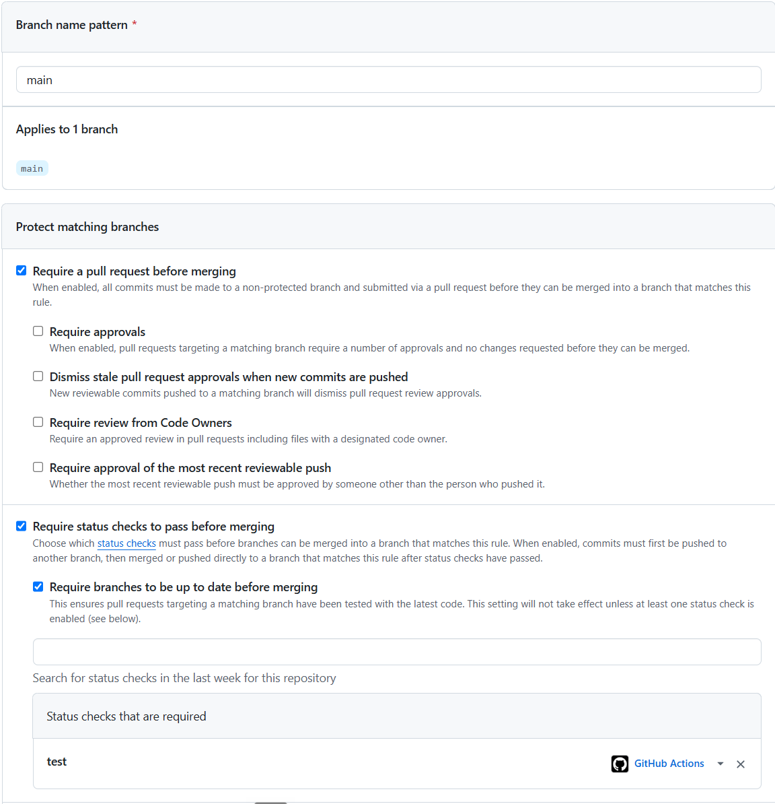
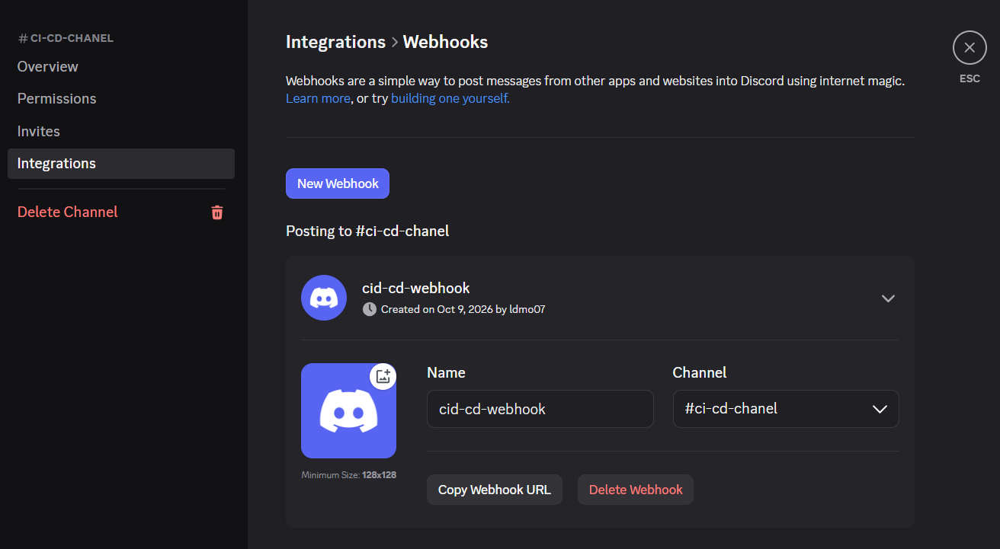
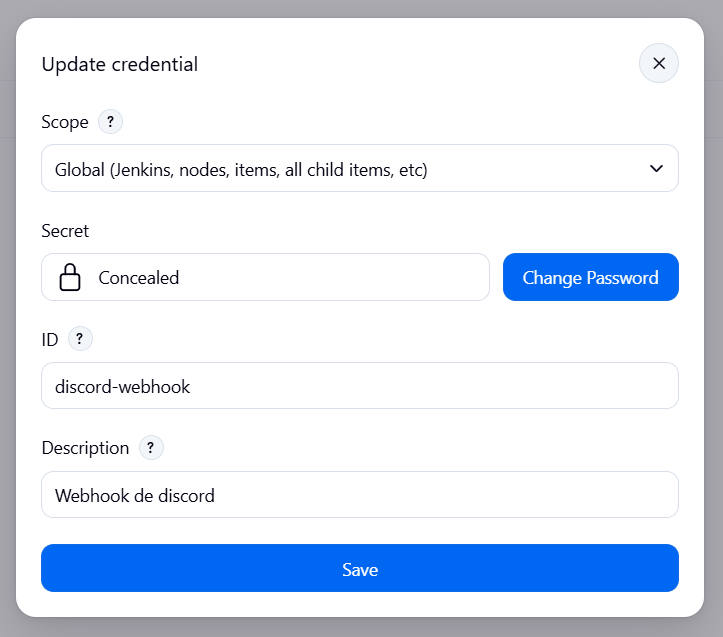

# CI/CD local con Jenkins
Infraestructura y plantillas para un flujo de CI/CD local: un contenedor de Jenkins (Docker Desktop, contenedores Linux, host Windows) detecta por polling los pushes a `main` de varios repositorios públicos de GitHub y despliega cada aplicación en su propio contenedor. La calidad se valida antes de llegar a `main` con una puerta de PR en GitHub Actions (lint + tests), y cada deploy se notifica a un canal de Discord.

Este repositorio no contiene código de aplicación ni suite de pruebas propia: contiene el Jenkins, el patrón de pipeline (`Jenkinsfile.template`) y cinco apps de ejemplo (node, python, dotnet, react, angular) que se copian a repos independientes.

## Flujo completo

```
rama → Pull Request → GitHub Actions (check "test") → merge → Jenkins → Build → Deploy → Smoke check → aviso en Discord
```

| Etapa | Quién | Qué hace |
|---|---|---|
| Antes de `main` | **GitHub Actions** (solo puerta de calidad) | En cada PR hacia `main` ejecuta lint + tests. Con branch protection, sin el check en verde no se puede hacer merge |
| Después de `main` | **Jenkins** (único CI/CD) | Detecta el push (polling cada minuto), construye la imagen, despliega el contenedor y hace un smoke check |
| Al terminar | **Jenkins** | Envía el resultado (éxito o fallo) a Discord |

Actions nunca construye imágenes, despliega ni hace push: ese trabajo es solo de Jenkins.

## Enlaces de documentación del proyecto
 - [Notificaciones de deploy a Discord (webhook + credencial en Jenkins)](docs/discord-notifications.md)
 - [Diseño del CI/CD local con Jenkins](docs/superpowers/specs/2026-10-06-jenkins-local-cicd-design.md)
 - [Plan de implementación](docs/superpowers/plans/2026-10-06-jenkins-local-cicd.md)
 - [Pipeline base: `templates/Jenkinsfile.template`](templates/Jenkinsfile.template)

## Repositorios de las aplicaciones
Cada app vive en su propio repositorio (clonados dentro de esta carpeta, pero ignorados por git aquí):

| Repo | Stack | Puerto host → contenedor | Tests (`npm test` / equivalente) |
|---|---|---|---|
| [ci-cd-node](https://github.com/ldmo07/ci-cd-node) | Express | 8081 → 3000 | `node --test` + ESLint |
| [ci-cd-python](https://github.com/ldmo07/ci-cd-python) | Flask + gunicorn | 8082 → 5000 | `pytest` + `ruff` |
| [ci-cd-dotnet](https://github.com/ldmo07/ci-cd-dotnet) | ASP.NET Core 8 (minimal API) | 8083 → 8080 | xUnit (`dotnet test tests/Api.Tests`) + `dotnet format` |
| [ci-cd-react](https://github.com/ldmo07/ci-cd-react) | React 18 + Vite | 8084 → 80 | Vitest + ESLint |
| [ci-cd-angular](https://github.com/ldmo07/ci-cd-angular) | Angular 22 | 8085 → 80 | Vitest + angular-eslint |

Jenkins ocupa el 8080 del host. Los puertos de host no se validan: si dos apps usan el mismo, el `docker run` de la segunda falla, y el contenedor anterior de esa app ya fue removido. El 8080 de .NET es el puerto del contenedor, no del host.

Las apps React (`:8084`) y Angular (`:8085`) llaman desde el navegador a la API .NET (`:8083/personas`), por eso la API tiene CORS habilitado.

## Autores

- [@ldmo07](https://github.com/ldmo07)


## Distintivos

[](https://www.jenkins.io/)
[](https://docs.docker.com/compose/)
[](https://docs.github.com/actions)

> **Pendiente:** el repositorio no tiene archivo `LICENSE`; agregarlo y, entonces, añadir el distintivo de licencia.


## Ambiente de pruebas
No hay ambiente de QA/staging separado: el entorno completo corre en local. Jenkins es accesible en `http://localhost:8080` y las apps en `http://localhost:8081` a `http://localhost:8085`.

> **Pendiente:** si más adelante existe un ambiente remoto, agregar su URL aquí.


## Deployment

### Local
Requisitos: Docker Desktop con contenedores Linux y Git (la shell en Windows es Git Bash).

```bash
# 1. Levantar Jenkins (http://localhost:8080)
docker compose up -d --build

# 2. Solo la primera vez: contraseña inicial de administrador
docker exec jenkins cat /var/jenkins_home/secrets/initialAdminPassword

# 3. Comprobar que Jenkins alcanza el daemon Docker del host
docker exec jenkins docker ps
```

Si las rutas se deforman en Git Bash, antepón `MSYS_NO_PATHCONV=1` a los `docker exec`.

`docker-compose.yml` monta `/var/run/docker.sock`: las apps son contenedores **hermanos** en el daemon del host, no anidados. Mantén la entrada `extra_hosts: host.docker.internal:host-gateway`: el smoke check llama a la app a través de ese nombre (si fallara, prueba `curl -4`, porque dentro de Jenkins resuelve solo por IPv6).

#### Añadir una aplicación nueva
1. En el repo de la app: un `Dockerfile` en la raíz y el `Jenkinsfile` copiado de `templates/Jenkinsfile.template`. Edita solo `APP_NAME`, `HOST_PORT` (único, desde 8081) y `CONTAINER_PORT`. Usa terminaciones de línea LF (`.gitattributes`): CRLF en el `Jenkinsfile` rompe el pipeline.
2. En el repo de la app: copia `.github/workflows/test.yml` del ejemplo de su stack (puerta de calidad de PR).
3. En Jenkins: *New Item → Pipeline → Pipeline script from SCM → Git*.
   - Repository URL: la del repo público.
   - Branch Specifier: `*/main`.
   - Script Path: `Jenkinsfile`.
   - Sin credenciales.
4. Ejecuta **Build Now** una vez: así Jenkins registra el `pollSCM`. Desde ahí cada push a `main` despliega solo (retraso máximo de ~1 minuto).
5. En GitHub, en el repo de la app: *Settings → Branches → Add branch protection rule* sobre `main`, con **Require a pull request before merging** y **Require status checks to pass before merging** (check `test`). El check solo aparece en el buscador después de que el workflow haya corrido una vez, así que abre antes un PR de prueba.

   

#### Verificar una app sin Jenkins
Desde su carpeta (`templates/examples/<stack>` o `ci-cd-<stack>`):

```bash
docker build -t <app>:test . && docker run -d --rm --name <app>-test -p <HOST_PORT>:<CONTAINER_PORT> <app>:test
curl -fsS http://localhost:<HOST_PORT>/ ; docker stop <app>-test ; docker rmi <app>:test
```

#### Trabajar una funcionalidad (con la protección de `main`)
```bash
git switch main && git pull
git switch -c feat/mi-funcionalidad
# código + tests
git add . && git commit -m "feat: ..." && git push -u origin feat/mi-funcionalidad
gh pr create --base main --fill        # o abrir el PR desde GitHub
# esperar el check "test" en verde → merge → Jenkins despliega en ~1–2 min
git switch main && git pull --prune && git branch -d feat/mi-funcionalidad
```

El workflow solo se dispara con `pull_request`: un push de la rama sin PR no ejecuta nada. Cada commit nuevo en un PR abierto vuelve a ejecutar el check.

### QA / Producción
No aplica: el despliegue es únicamente local mediante el pipeline de Jenkins descrito arriba.

### Comportamiento ante fallos
- **El build falla:** el contenedor anterior sigue corriendo (`docker rm -f` se ejecuta solo después de un build correcto).
- **`docker run` falla** (por ejemplo, puerto ocupado): build rojo; el contenedor anterior de esa app ya fue removido.
- **El smoke check falla** (15 intentos con `curl`): build rojo, con las últimas 50 líneas del log de la app.
- **Retención de imágenes:** se conservan las 3 últimas etiquetas numéricas por app; las demás y las huérfanas con la etiqueta `app=<APP_NAME>` se eliminan.
- **El aviso a Discord falla** (credencial ausente o error de red): solo deja una línea en el log; no afecta el deploy.


## Environment Variables
Ni los pipelines ni las apps de ejemplo leen variables de entorno. El único dato sensible es una **credencial de Jenkins**, no una variable de entorno:

| Credencial (Jenkins) | Tipo | Descripción | Requerida |
| :-- | :-- | :-- | :-- |
| `discord-webhook` | Secret text | URL del webhook del canal de Discord para los avisos de deploy | No (si falta, solo se omite el aviso) |

Cómo crear el webhook y la credencial: [docs/discord-notifications.md](docs/discord-notifications.md). La URL del webhook es un secreto: no la subas al repositorio (los repos son públicos).


## Screenshots

Configuración inicial, en el orden en que se hace:

**1. Branch protection en GitHub** (por cada repo de app, sobre `main`)


**2. Webhook en Discord** (ajustes del canal → Integraciones → Webhooks)



**3. Credencial `discord-webhook` en Jenkins** (Manage Jenkins → Credentials)



> **Pendiente:** agregar una captura del mensaje que llega al canal de Discord y de un job en Jenkins.


## Tech Stack

**CI/CD:** Jenkins LTS (JDK 21) con los plugins `git`, `workflow-aggregator` y `docker-workflow`; Docker CLI + Buildx dentro de la imagen de Jenkins

**Puerta de calidad de PR:** GitHub Actions (`.github/workflows/test.yml` en cada repo de app)

**Notificaciones:** Discord (webhook entrante, `curl`)

**Apps de ejemplo:** Node / Express, Python / Flask, .NET 8, React 18 / Vite, Angular 22 (los workflows de CI usan Node 20 y Python 3.12; Angular usa Node 24)

**Pruebas y calidad:** `node --test`, `pytest` + `ruff`, xUnit, Vitest, ESLint 9 / angular-eslint, `dotnet format`

**Infraestructura:** Docker Desktop, Docker Compose


## Usage/Examples

Pipeline base (`templates/Jenkinsfile.template`): solo cambian tres variables por repo.

```groovy
environment {
    APP_NAME       = 'my-app'
    HOST_PORT      = '8081'
    CONTAINER_PORT = '3000'
}
// Etapas: Build (docker build) → Deploy (docker rm -f + docker run -d --restart unless-stopped)
//         → Smoke check (15 × curl) → post: aviso a Discord + limpieza de imágenes
```

Comprobar una app desplegada:

```bash
curl http://localhost:8081/          # node-example
curl http://localhost:8081/health    # {"status":"ok"}
curl http://localhost:8083/personas  # API .NET
```

## Límites conocidos
Solo repositorios públicos, sin webhooks de GitHub ni túnel (polling cada minuto), un único host Docker, sin reverse proxy, sin registry de imágenes y sin multi-nodo.
